# Backtester Study Guide

This is a plain-English learning doc for understanding the backtester from the ground up.

For the operating plan and next implementation phases, use:
- [Roadmap](./roadmap.md)

The goal is to understand the system in the order it actually thinks:

1. find stocks
2. filter bad ones out
3. analyze the survivors
4. decide `BUY / WATCH / NO_BUY`
5. send alerts
6. save history so the system can learn later

## Overview

### Big Picture

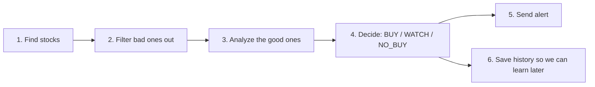

### When To Run What

Simple operator cadence:

- `daytime_flow.sh`
  - run during market hours when you want the live operator view
- `nighttime_flow.sh`
  - run after market close or overnight to refresh tomorrow’s inputs
- `backtest_flow.sh`
  - run when you want historical strategy testing, not live trade guidance
- `experimental_report_flow.sh`
  - run only when you want optional paper-only research ideas
- `experimental_maintenance_flow.sh`
  - run occasionally to settle old research snapshots and refresh calibration artifacts

Default routine:

```bash
# Night before / after close
./scripts/nighttime_flow.sh

# Next trading day
./scripts/daytime_flow.sh
```

## Core Trading Flow

### Phase 1: Find Stocks

Main file:
- `/Users/hd/Developer/cortana-external/backtester/data/universe.py`

Plain-English job:
- build the list of names the system is willing to consider

This is the first question the system asks:
- "What stocks should we even look at?"

#### Where names come from

For the nightly path, the system tries sources in this order:

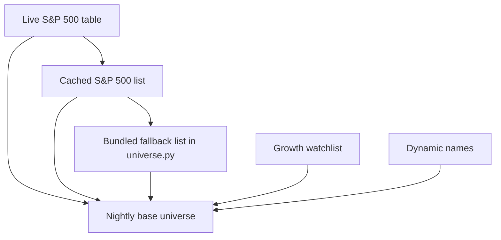

Important note:
- the bundled `SP500_TICKERS` list is only a fallback it is not the full current S&P 500
- the nightly path is best when the live constituent refresh works

#### Mental model

- `universe.py` is the scout
- it is responsible for building the candidate pool

### Phase 2: Filter Bad Ones Out

Still mainly in:
- `/Users/hd/Developer/cortana-external/backtester/data/universe.py`

Main function:
- `screen()`

Plain-English job:
- remove names that are weak, illiquid, too noisy, or not worth deeper analysis

This is the second question the system asks:
- "Which of these names are not worth more time?"

#### Screening flow

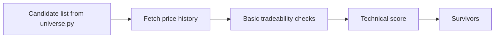

#### What gets filtered early

Examples:
- names with bad or missing price history
- names that are too cheap
- names that are too illiquid
- names that fail the minimum technical threshold

#### Technical score idea

The first-pass technical score is a simple chart-quality check:

- `N`: is the stock near highs?
- `L`: does it have momentum / leadership?
- `S`: is volume behavior supportive?

This is not yet the final trade decision.

It is just:
- "Does this chart look interesting enough to deserve deeper analysis?"

#### Phase 1 + 2 Together

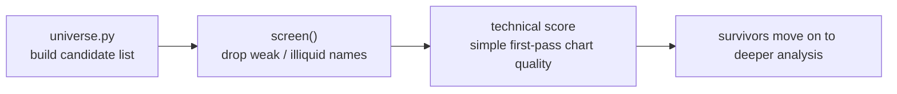

### Phase 3: Analyze Survivors

Main file:
- `/Users/hd/Developer/cortana-external/backtester/advisor.py`

Plain-English job:
- take a stock that already survived screening
- analyze it more deeply
- turn that analysis into a real recommendation

This is the third question the system asks:
- "Now that this stock looks interesting, what should we actually do with it?"

#### What advisor.py is

Simple mental model:
- `universe.py` is the scout
- `advisor.py` is the judge

`advisor.py` is the main decision engine.

It combines:
- market regime
- price history
- fundamentals
- technical signals
- strategy logic
- risk / confidence adjustments

#### Advisor Flow

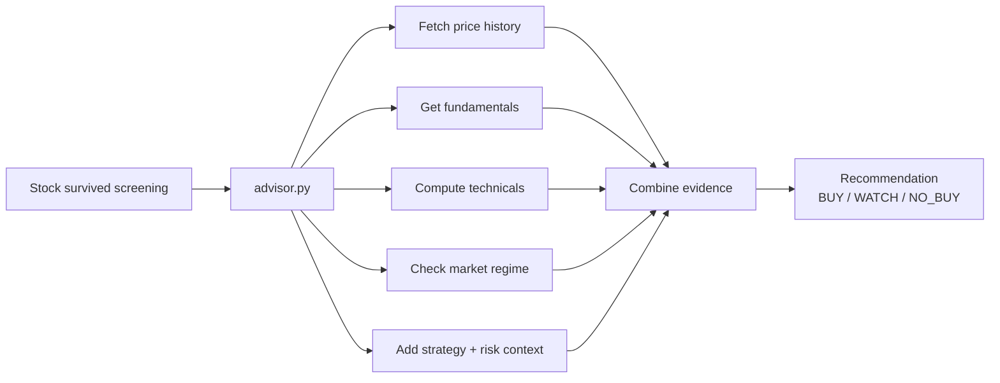

#### What advisor.py looks at

##### 1. Price history

The advisor first gets recent market data for the stock.

This is used for:
- chart structure
- momentum
- breakout quality
- exit risk

This is the basic question:
- "What has the stock actually been doing?"

##### 2. Fundamentals

The advisor pulls fundamental data like:
- earnings growth
- annual growth
- institutional ownership
- share / float context

This is the basic question:
- "Is the business strong enough to support the chart?"

##### 3. Technicals

The advisor also scores the stock technically.

This includes:
- proximity to highs
- momentum
- volume behavior
- breakout follow-through

This is the basic question:
- "Does the chart still look healthy?"

##### 4. Market regime

The advisor checks the overall market before trusting the stock.

This matters because:
- a decent stock setup can still be a bad buy in a weak market
- the system is allowed to be more aggressive in strong market conditions
- the system should be more cautious in corrections

This is the basic question:
- "Even if the stock looks good, are market conditions good enough?"

Important clarification:
- market regime is primarily owned by the Python market-regime engine

Simple version:
- market regime = "How healthy is the market?"
- Polymarket = "Is there extra macro/event context worth noting?"

##### 5. Risk / confidence / overlays

The advisor also adjusts the final recommendation using:
- confidence
- uncertainty
- trade quality
- churn / downside penalties
- optional overlays

This is the basic question:
- "How much should we trust this setup?"

Where this comes from:
- confidence / uncertainty / trade quality come from the Python confidence-scoring layer
- downside / churn penalties come from the Python trade-quality and risk logic
- market regime stress comes from the Python market-regime and adverse-regime logic
- optional overlays come from extra bounded Python overlay helpers like risk-budget or execution-quality context

Simple version:
- confidence = how strong the setup looks after combining the evidence
- uncertainty = how noisy or unreliable the setup may be
- trade quality = overall quality after penalties and context
- overlays = extra bounded adjustments, not full decision authority

#### The output of advisor.py

At the end, the advisor produces a recommendation:

- `BUY`
- `WATCH`
- `NO_BUY`

That recommendation is what later gets turned into:
- alert messages
- watchlists
- quick-check results

#### How Analysis Becomes Action

This is the key transition inside `advisor.py`:
- first the system gathers evidence
- then the recommendation engine turns that evidence into an action

Simple flow:

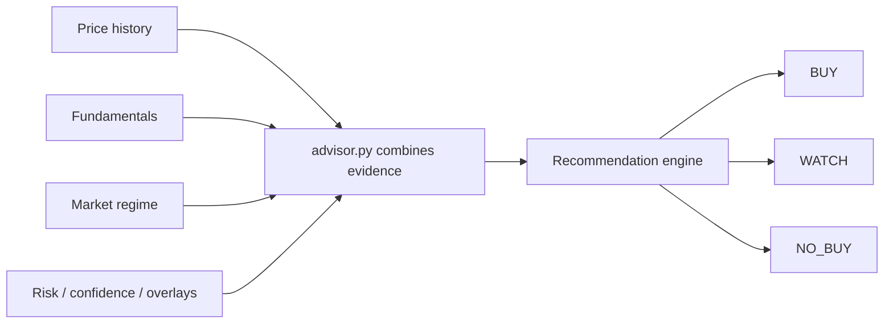

Plain-English meaning:
- `BUY` = strong enough to act on now
- `WATCH` = interesting, but not strong enough yet
- `NO_BUY` = not a current setup

This is important:
- the system is not just looking at one score
- it is combining multiple kinds of evidence and then making a rule-based decision

Examples of what can push a stock toward `BUY`:
- strong total score
- healthy chart
- supportive market regime
- better confidence / trade quality

Examples of what can keep it at `WATCH`:
- some good signs, but not enough confirmation
- setup is interesting but still early
- decent stock, but not enough conviction yet

Examples of what can push it to `NO_BUY`:
- weak market regime
- bad risk / confidence profile
- weak or broken chart
- not enough supporting evidence overall

Important mental model:
- a stock can be a good company and still be `NO_BUY`
- a stock can look interesting and still only be `WATCH`
- the system is trying to answer:
  - "Is this a setup I should act on now?"

### Phase 4: Delivery Layer

Main files:
- `/Users/hd/Developer/cortana-external/backtester/canslim_alert.py`
- `/Users/hd/Developer/cortana-external/backtester/dipbuyer_alert.py`
- `/Users/hd/Developer/cortana-external/backtester/advisor.py --quick-check`

Plain-English job:
- take the internal decision and turn it into something the operator can actually read

This is the next question the system asks:
- "How should this decision be shown to me?"

#### Delivery Flow

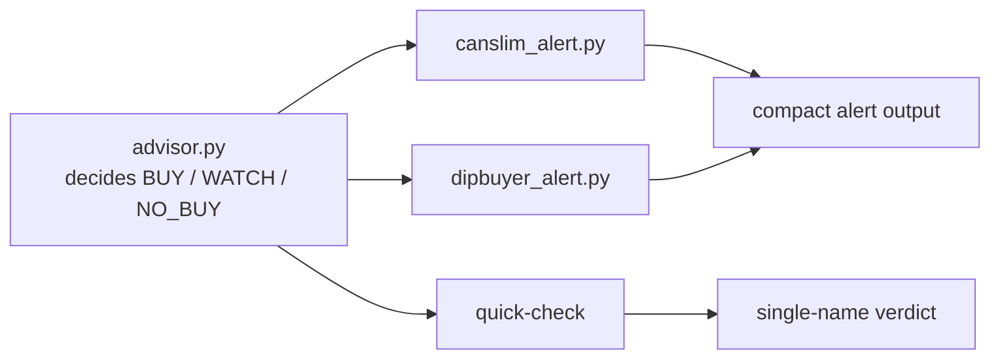

#### Why there are multiple outputs

The system does not have only one output format because not every use case is the same.

Different operator questions need different surfaces:

- "Give me the CANSLIM-style stock summary."
- "Give me the dip-buyer summary."
- "Tell me quickly if this one name is worth attention."

So the delivery layer is not making new decisions.

It is taking the decision that already exists and packaging it in the right format.

#### CANSLIM alert

File:
- `/Users/hd/Developer/cortana-external/backtester/canslim_alert.py`

Plain-English meaning:
- this is the compact summary for the CANSLIM-style path

Use it when you want:
- a summarized list of the strongest CANSLIM-style setups

#### Dip Buyer alert

File:
- `/Users/hd/Developer/cortana-external/backtester/dipbuyer_alert.py`

Plain-English meaning:
- this is the compact summary for the buy-the-dip path

Use it when you want:
- a summarized list of dip-style setups and watch names

#### Quick-check

Surface:
- `uv run python advisor.py --quick-check SYMBOL`

Plain-English meaning:
- this is the fastest single-name verdict path

Use it when you want:
- one bounded answer for one stock, proxy, or coin

Examples:

```bash
uv run python advisor.py --quick-check NVDA
uv run python advisor.py --quick-check BTC
```

#### Simple mental model

- `advisor.py` is the brain
- alert scripts are the messenger
- `quick-check` is the fastest one-name messenger

The important idea:
- the alert layer usually does not decide what to buy
- it tells you what the decision engine already concluded

### Phase 5: Learning Loop

Main files:
- `/Users/hd/Developer/cortana-external/backtester/experimental_alpha.py`
- `/Users/hd/Developer/cortana-external/backtester/buy_decision_calibration.py`

Plain-English job:
- save what the system thought before
- come back later and measure what actually happened
- summarize whether those old ideas were useful

This is the next question the system asks:
- "Were our earlier ideas actually right?"

#### Learning Loop Flow

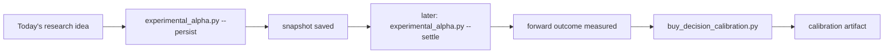

#### Step 1: Persist

Command:

```bash
uv run python experimental_alpha.py --persist
```

Plain-English meaning:
- save today’s research candidates to disk
- remember what the system thought at that moment

Simple version:
- "Today, these were the ideas."

#### Step 2: Settle

Command:

```bash
uv run python experimental_alpha.py --settle
```

Plain-English meaning:
- go back to saved snapshots later
- check what happened after those snapshots
- measure forward returns

Simple version:
- "Were those old ideas actually good?"

#### Step 3: Calibrate

Command:

```bash
uv run python buy_decision_calibration.py
```

Plain-English meaning:
- summarize the settled history
- measure hit rate, return behavior, and whether there is enough evidence to trust the patterns

Simple version:
- "What have we learned from the old ideas?"

#### Simple mental model

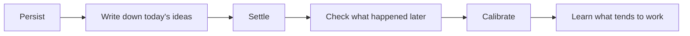

#### Why `no_settled_records` happens

Sometimes the calibration artifact exists but still says:
- `record_count: 0`
- `settled_candidates: 0`
- `reason: no_settled_records`

That usually means:
- the file was created correctly
- but there are no old research snapshots with settled outcomes yet

So this does **not** automatically mean:
- the pipeline is broken

It usually means:
- the notebook exists
- but it is still empty

#### Why this matters

Without the learning loop, the system can only say:
- "Here is what I think right now."

With the learning loop, the system can eventually say:
- "Here is what I think right now, and here is how similar past ideas actually performed."


### Nightly Leader Buckets vs Live Watchlists

This is a separate concept from the final Dip Buyer or CANSLIM watchlist.

Simple flow:

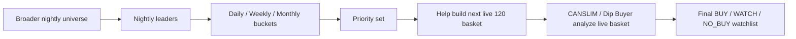

Plain-English meaning:
- nightly leader buckets are **leadership memory**
- final CANSLIM / Dip Buyer watchlists are **live decision output**

What that means:
- a name in `daily`, `weekly`, or `monthly` helped shape who got extra attention in the next live scan
- but it does **not** automatically mean that name must appear in the final Dip Buyer watchlist
- the final watchlist still comes from the strategy engine after it analyzes the live 120 basket

Mental model:
- leader buckets = "who keeps showing leadership over time?"
- final watchlist = "who looks actionable or worth watching right now?"

How to read the bucket lines:
- `OXY +3.2% (1x)`
  - `+3.2%` = the move over that bucket window
  - `(1x)` = OXY has appeared once in that bucket window so far
- `OXY +8.4% (4x)`
  - the move is stronger over the weekly window
  - and the name has shown up repeatedly, which means stronger persistence

Why both fields matter:
- `% move` tells you how strong the move has been
- `(x appearances)` tells you whether the move is persistent or just a one-off pop

## Putting It Together

### Full System Diagram

This is the full end-to-end view of what we built.

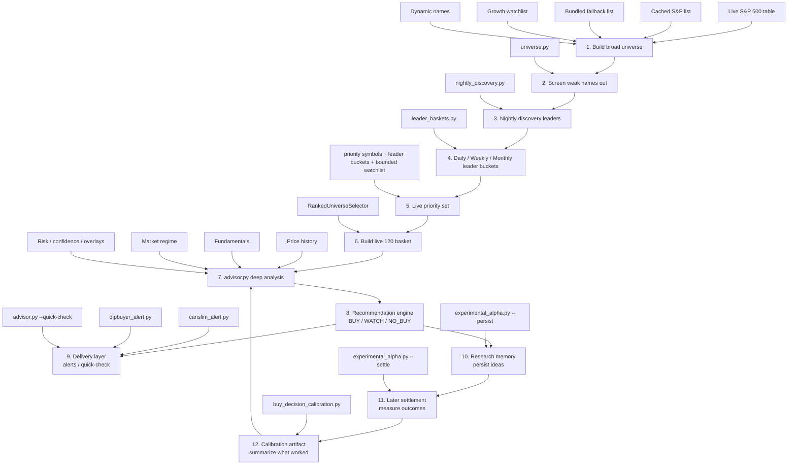

### How Important `.cache` Is

The `.cache` directory is operationally important, but it is not the same thing as source code.

Simple mental model:
- code = the brain
- `.cache` = working memory and prepared inputs
- `var/` and run artifacts = the historical diary of what actually happened

What usually lives in `.cache`:
- refreshed market-regime snapshots
- research snapshots and settled outcomes
- calibration artifacts
- other rebuildable intermediate files used to make the system faster, fresher, or more consistent

What happens if `.cache` is missing:
- the repo is not ruined forever
- many files can be rebuilt by rerunning the normal commands
- but the live system may become slower, less informed, or forced into fallback behavior until those files are refreshed again

Practical importance by category:
- important for live quality and speed:
  feature snapshots, liquidity overlays, regime snapshots
- important for learning/history:
  experimental alpha snapshots, settled outcomes, calibration inputs
- usually rebuildable:
  temporary fetch outputs and intermediate cache files

So the right mental model is:
- `.cache` is not source code
- but it is still very important operational memory
