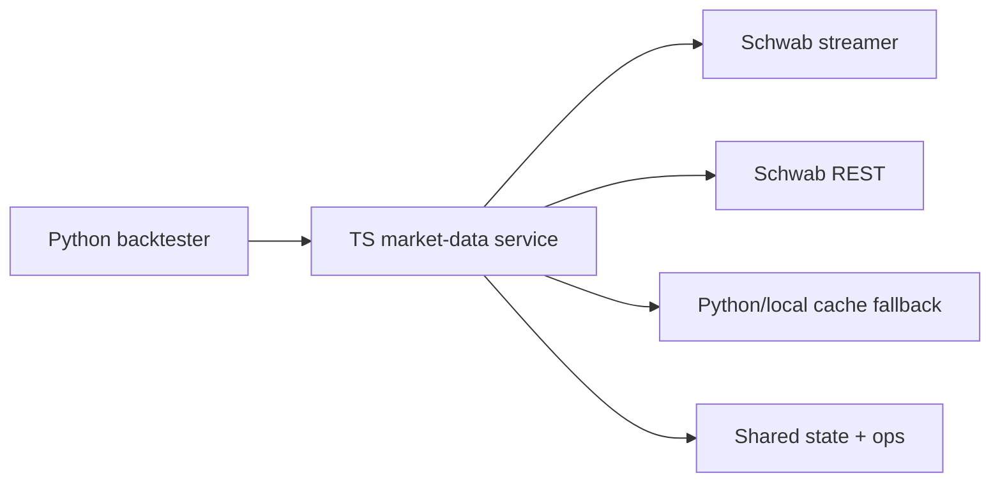

# Market-Data Service Reference

This is the compact operator reference for the Schwab-first TS market-data service used by the backtester.

## Quick Model



The Python layer asks for normalized market data. TS decides which provider to use and how to recover when one layer is unhealthy.

## Shared State

- Postgres shared streamer state is now the default.
- File-backed shared state is dev-only and should be treated as a local convenience path, not the production default.
- Follower instances read shared quote/chart state from the leader and do not open their own Schwab socket.

## Readiness and Ops

### `GET /market-data/ready`

Use this when you want a fast yes/no answer before starting a scan or wrapper.

It is meant to answer:

- is the TS service up?
- is the streamer in a usable state?
- is the service degraded enough that a run should wait or fall back?

Treat it as a gate, not a full health dump.

### `GET /market-data/ops`

Use this for the compact operator view.

It surfaces the things operators usually need first:

- streamer role and lock ownership
- health and fallback mix
- symbol-budget state
- shared-state mode
- recovery-related state such as reconnect pressure and token status

## Batch Endpoints

Use batch routes when you want one shared request shape across many symbols.

- `GET /market-data/history/batch`
- `GET /market-data/quote/batch`

Why they matter:

- fewer HTTP round trips
- less repeated fallback work
- better for scans, dashboards, and external tooling

Rule of thumb:

- use single-symbol routes for spot checks
- use batch routes for scans or lists

## Single-Symbol Routes

Common endpoints:

- `GET /auth/schwab/url`
- `GET /auth/schwab/callback`
- `GET /auth/schwab/status`
- `GET /market-data/history/:symbol`
- `GET /market-data/quote/:symbol`
- `GET /market-data/snapshot/:symbol`
- `GET /market-data/fundamentals/:symbol`
- `GET /market-data/metadata/:symbol`
- `GET /market-data/universe/base`
- `POST /market-data/universe/refresh`
- `GET /market-data/risk/history`
- `GET /market-data/risk/snapshot`

History requests accept the usual provider controls documented by the service and the main study guide.

## Local Schwab OAuth

Use this flow when you need to create or rotate the local Schwab refresh token.

Portal callback to register:

```text
https://127.0.0.1:8182/auth/schwab/callback
```

Operator flow:

1. Start the service with local TLS cert/key paths configured.
2. Call `GET /auth/schwab/url`.
3. Open the returned Schwab authorize URL in a browser.
4. Let Schwab redirect back to `https://127.0.0.1:8182/auth/schwab/callback`.
5. Confirm the saved token state with `GET /auth/schwab/status`.

Notes:

- `127.0.0.1` is the safe local callback host for Schwab.
- The callback listener is HTTPS because Schwab requires `https://`.
- The refresh token is persisted to `SCHWAB_TOKEN_PATH`.
- A local self-signed cert/key now exists at:
  - `/Users/hd/Developer/cortana-external/.certs/127.0.0.1.pem`
  - `/Users/hd/Developer/cortana-external/.certs/127.0.0.1-key.pem`

## Streamer Recovery Basics

The streamer is supervised, not left to run blindly.

High-level recovery flow:

1. detect a disconnect, failed command, or stale state
2. try reconnect or resubscribe
3. if Schwab is not usable, fall back through the provider chain
4. expose the degraded state through ops and readiness

What the recovery logic is trying to prevent:

- silent symbol drift
- repeated command races
- long stretches of stale quotes after a reconnect
- operator confusion about whether the service is healthy enough to use

### Reconnect Jitter and Cooldown

- reconnect backoff now uses jitter at a high level so many instances do not retry in lockstep after an outage
- repeated Schwab REST failures open a short cooldown window instead of letting every request keep timing out
- both behaviors reduce thundering-herd retries and keep degraded periods visible but controlled

## Schwab Token State

Token refresh is single-flight, so the service does not stampede the refresh endpoint.

There is one important human-action-required case:

- if the Schwab token can no longer be refreshed automatically, the service should surface that clearly as an operator problem
- this is not a normal retry loop failure
- treat it as a state that needs manual intervention, not just more traffic

## Account Activity Groundwork

The service now has groundwork for account activity streaming.

Why this matters:

- it is the foundation for real-time fills and position awareness
- it is the path toward a future hold / trim / sell layer
- it is separate from the current analysis-only workflow

For now, consider it infrastructure for the next phase rather than a live trading surface.

## Practical Operator Notes

- Use `/market-data/ready` before a full run if you want a quick gate.
- Use `/market-data/ops` when you need the current streamer story in one place.
- Use batch endpoints for scan-style workloads.
- Treat file shared-state mode as dev-only.
- Treat token refresh failures as human-action-required if the refresh path is exhausted.
