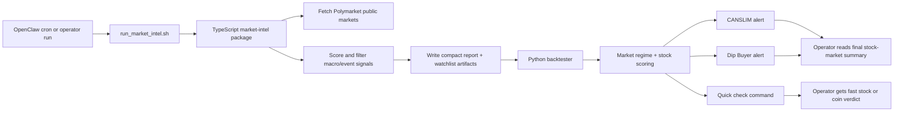

# Polymarket + Backtester Flow

This is the simplest user-facing view of how the stock-analysis flow works.

## Plain-English version

- OpenClaw or an operator starts the scheduled run.
- The `run_market_intel.sh` bridge runs the TypeScript Polymarket intelligence layer first.
- That layer fetches public Polymarket markets, keeps only high-signal macro/event context, and writes artifact files.
- The Python backtester then reads those artifacts together with its own market-regime and stock-scoring logic.
- The final thing the user sees is either a CANSLIM/Dip Buyer stock-analysis alert or a fast quick-check verdict, both with better macro context.

## Mental model

- OpenClaw: scheduler / runner
- TypeScript layer: external macro and event intelligence
- Python layer: stock analysis and alert generation
- Final output: better-informed alerts and quick checks, not automatic trades
