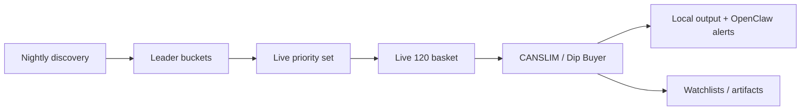
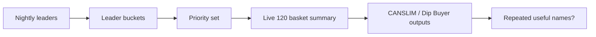
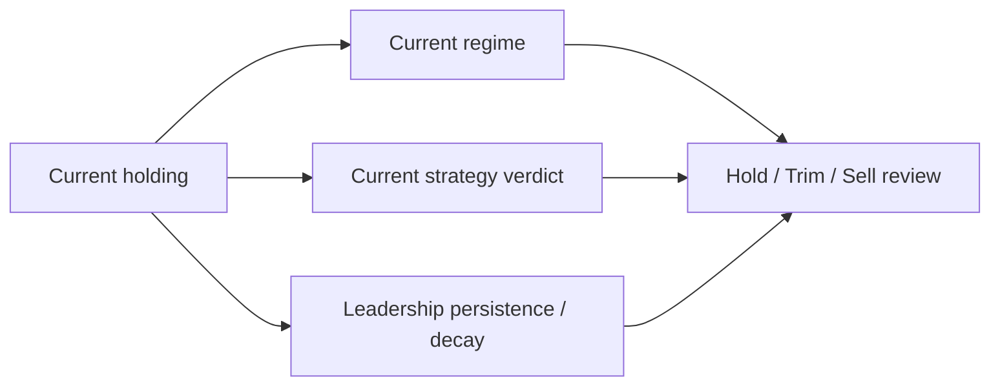
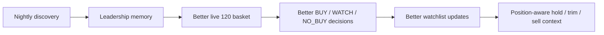

# Backtester Roadmap

This roadmap is the operating plan for improving the stock-decision system without losing the current production shape.

Use this document when you want to answer:
- what to observe this week
- what to review after more data accumulates
- how to decide whether a change is actually helping
- what should happen next if the evidence is good or bad

This is intentionally written so another LLM or engineer can pick it up and continue the work without reconstructing the whole project history.

## Operating Goal

The long-term goal is to move from:
- "scan stocks, show alerts, and make money"

to:
- "maintain a living leadership map, build a better live 120-name basket, surface the best current `BUY / WATCH / NO_BUY` opportunities, and eventually support better hold / trim / sell judgment"

That breaks into five practical goals:
- improve the quality of the live 120 basket
- improve the quality of the final CANSLIM and Dip Buyer watchlists
- make leadership persistence visible and useful
- add position-aware hold / trim / sell context
- keep the operator surface understandable
- only promote new logic when artifacts and live runs show evidence that it helps

## Current System Shape

The current production shape is:



Important current behaviors:
- `nighttime_flow.sh` refreshes the broader discovery path and rebuilds leader buckets
- `daytime_flow.sh` uses those leader buckets as soft-priority input into the live 120 basket
- CANSLIM and Dip Buyer still own the final `BUY / WATCH / NO_BUY` decisions
- leader buckets are selection input, not trade authority
- experimental research exists, but it is not the main operator loop right now

Important gap:
- the system does not yet have a first-class position-aware sell layer
- it can tell you what looks strong or weak now, but it does not yet formally answer:
  - what do I already own?
  - should I keep holding it?
  - should I trim it?
  - should I exit it?

## Source Of Truth

When reviewing progress, use these artifacts first:

- local operator outputs:
  - `/Users/hd/Developer/cortana-external/backtester/var/local-workflows/`
- leader bucket artifacts:
  - `/Users/hd/Developer/cortana-external/backtester/.cache/leader_baskets/leader-baskets-latest.json`
  - `/Users/hd/Developer/cortana-external/backtester/.cache/leader_baskets/daily.txt`
  - `/Users/hd/Developer/cortana-external/backtester/.cache/leader_baskets/weekly.txt`
  - `/Users/hd/Developer/cortana-external/backtester/.cache/leader_baskets/monthly.txt`
  - `/Users/hd/Developer/cortana-external/backtester/.cache/leader_baskets/priority.txt`
- local market context:
  - `/Users/hd/Developer/cortana-external/backtester/.cache/market_regime_snapshot_SPY.json`
- unified trading run artifacts in Cortana:
  - `/Users/hd/Developer/cortana/var/backtests/runs/`

Important files for future implementation work:
- `/Users/hd/Developer/cortana-external/backtester/data/universe.py`
- `/Users/hd/Developer/cortana-external/backtester/data/universe_selection.py`
- `/Users/hd/Developer/cortana-external/backtester/data/leader_baskets.py`
- `/Users/hd/Developer/cortana-external/backtester/nightly_discovery.py`
- `/Users/hd/Developer/cortana-external/backtester/canslim_alert.py`
- `/Users/hd/Developer/cortana-external/backtester/dipbuyer_alert.py`
- `/Users/hd/Developer/cortana-external/backtester/scripts/daytime_flow.sh`
- `/Users/hd/Developer/cortana-external/backtester/scripts/nighttime_flow.sh`
- `/Users/hd/Developer/cortana-external/backtester/scripts/local_output_formatter.py`

## Weekly Observation Loop

### Objective

Observe whether the current nightly-to-daytime workflow is producing believable leadership memory and believable live watchlists.

### Why This Matters

The system is only useful if:
- nightly discovery finds names with persistent strength
- those names help improve the live 120 basket
- the live 120 basket helps CANSLIM and Dip Buyer surface better final watchlists

If the nightly bucket system does not affect the live basket in a useful way, the new architecture is just additional complexity.

### What To Run

Default routine:

```bash
cd /Users/hd/Developer/cortana-external/backtester
./scripts/nighttime_flow.sh
./scripts/daytime_flow.sh
```

Recommended cadence:
- run `nighttime_flow.sh` after market close or overnight
- run `daytime_flow.sh` at least once during market hours
- if desired, run `daytime_flow.sh` more than once in the same day to compare market-state drift

### What To Inspect

For each observation day, inspect:
- the market regime block at the top of `daytime_flow.sh`
- the leader bucket section
- the CANSLIM section
- the Dip Buyer section
- the saved local output folder under `/Users/hd/Developer/cortana-external/backtester/var/local-workflows/`

Key questions:
- do the leader buckets look plausible?
- do repeated names make intuitive sense?
- does the `Priority set` look better than the old pinned-heavy behavior?
- does `Scan input: X pinned + Y ranked` still show the ranked selector owning most of the basket?
- do CANSLIM and Dip Buyer outputs feel cleaner or more relevant than before?

### Good Outcomes

Signs the weekly observation loop is healthy:
- `priority.txt` stabilizes around names that repeatedly look strong
- `daytime_flow.sh` shows a relatively small pinned count and a high ranked count
- top names considered by CANSLIM are no longer mostly static favorites
- Dip Buyer watchlists feel more like current market leaders and less like stale defaults
- the local output tells a coherent story from market regime -> leader buckets -> live strategy output
- repeated owned names could plausibly become future hold / trim / sell candidates once position tracking exists

### Bad Outcomes

Warning signs:
- leader buckets churn wildly with low signal
- the same stale names dominate the priority set for bad reasons
- the live basket still looks mostly pinned or arbitrary
- Dip Buyer or CANSLIM outputs do not reflect any visible influence from leader persistence
- outputs feel inconsistent or contradictory

### Next Action If Good

- keep observing for another week
- start tracking which names repeat across daily, weekly, and monthly windows
- compare those repeated names against the actual final watchlists

### Next Action If Bad

- inspect the nightly discovery leader generation
- inspect leader-bucket construction and limits
- inspect the priority selection logic in `/Users/hd/Developer/cortana-external/backtester/data/universe_selection.py`
- ask whether the priority window or bucket limits are too wide, too narrow, or too noisy

## Two-Week Review

### Objective

Decide whether leader buckets are actually improving the live 120 basket.

### Why This Matters

This is the central question for the current wave of work.

The system was previously too dominated by large pinned sets. The point of the leader-bucket work was to make the live basket more responsive to real leadership and less dependent on stale operator curation.

### How The System Knows

The system cannot "know" this from one run. It has to compare evidence across multiple artifacts and days.

The review should compare:
- nightly leader buckets
- live basket construction summaries
- CANSLIM top names
- Dip Buyer watchlists
- repeated symbols across days

Simple evaluation flow:



### What To Compare

For a 2-week review, compare these:

1. Leader persistence
- which names appear repeatedly in `daily`, `weekly`, and `monthly`
- which names graduate from daily-only to weekly or monthly

2. Live basket composition
- review `Scan input: X pinned + Y ranked`
- confirm the ranked slice remains large
- confirm the pinned slice is bounded

3. Surface overlap
- inspect the local `Leader-bucket overlap:` line inside CANSLIM and Dip Buyer
- check whether the overlap is plausible
- check whether repeated bucket leaders are getting meaningful attention in the live strategies

4. Final strategy usefulness
- compare the bucket names against the actual final watchlists
- ask whether the final watchlists look stronger, more current, and less arbitrary than before

### Questions To Answer

- are repeated bucket leaders becoming top names considered by CANSLIM?
- are repeated bucket leaders appearing in Dip Buyer watchlists more often than random names?
- is the system promoting names that look like real durable leadership rather than one-day pops?
- are strong repeated names missing from the final live outputs too often?
- are the final watchlists dominated by names with no bucket memory?

### Good Outcomes

Evidence that leader buckets are helping:
- repeated daily/weekly/monthly names show up in top live outputs
- CANSLIM top names increasingly overlap with the priority set in sensible ways
- Dip Buyer watchlists contain more persistent-strength names and fewer stale one-offs
- the live basket composition remains mostly ranked rather than mostly pinned
- operator trust improves because the system story is easier to follow

### Bad Outcomes

Evidence that leader buckets are not helping enough:
- the priority set rarely overlaps with final watchlists
- repeated bucket names still do not show up in live top names
- the live 120 basket remains effectively pinned-heavy in practice
- bucket names feel disconnected from what the strategies care about
- the watchlists still feel noisy or arbitrary

### Next Action If Good

- keep the current structure
- consider surfacing bucket overlap in more operator surfaces, including unified alerts later
- begin designing watchlist promotion/demotion logic based on persistence

### Next Action If Bad

- tune priority limits
- tune daily/weekly/monthly bucket sizes
- reconsider how many bucket names feed the live priority set
- inspect whether nightly leader generation is surfacing the wrong names

## Monthly Review

### Objective

Use accumulated bucket history to decide whether leadership persistence should begin affecting watchlist management more explicitly.

### Why This Matters

The current bucket work is mostly:
- selection input
- operator context

The next level is:
- deciding whether leadership persistence should help manage watchlist promotions and demotions
- deciding whether leadership persistence decay should later help manage hold / trim / sell context

### What To Inspect

- bucket history under `/Users/hd/Developer/cortana-external/backtester/.cache/leader_baskets/history`
- `leader-baskets-latest.json`
- `daily.txt`, `weekly.txt`, `monthly.txt`
- local workflow output history
- unified run watchlist artifacts in `/Users/hd/Developer/cortana/var/backtests/runs/`

### Questions To Answer

- which names stayed strong for multiple weeks?
- which names started as daily leaders and later disappeared?
- which names repeatedly surfaced in Dip Buyer or CANSLIM watchlists?
- which names were persistent leaders but never became actionable?
- which names became actionable without persistent bucket support?
- which names showed obvious leadership decay that would have been useful sell or trim context if they were already owned?

### Good Outcomes

Signs the monthly review is healthy:
- monthly buckets begin to feel like durable leadership rather than random survivors
- some names clearly show a path from daily -> weekly -> monthly persistence
- persistent leaders are visible in later watchlists and top-name summaries

### Bad Outcomes

Warning signs:
- monthly buckets are still noisy and arbitrary
- there is no visible relationship between persistence and live outputs
- the same names persist for reasons that do not seem actionable

### Next Action If Good

- define a simple watchlist promotion model
- define a simple watchlist demotion model
- consider a persistence score for each symbol
- start designing a position-aware review layer for hold / trim / sell context

### Next Action If Bad

- review the nightly leader selection methodology
- review rank score thresholds and bucket limits
- inspect whether current universe filtering is biasing the buckets badly

## One-To-Two Month Follow-Up

### Objective

Decide whether the system is ready to evolve from:
- "live basket selection aided by buckets"

to:
- "watchlist and position state management informed by persistence"

### Why This Matters

This is where the current work starts becoming more strategic. If persistence history is useful, it can help with:
- better watchlist updates
- better conviction when a dip occurs in a persistent leader
- early clues about weakening leadership
- better position reviews for names already held

### Candidate Next Features

If the evidence is good, the next feature wave should be:

1. Watchlist promotions
- promote names that persist across daily -> weekly -> monthly

2. Watchlist demotions
- lower priority for names that drop out across those windows

3. Leadership persistence score
- a bounded score derived from:
  - appearance count
  - bucket tier
  - recency

4. Dip Buyer context upgrade
- distinguish between:
  - dip in a persistent leader
  - dip in a one-off mover

5. Hold / trim / sell review layer
- evaluate currently held names against:
  - current regime
  - current strategy verdict
  - leadership persistence
  - leadership decay
  - repeated downgrades from `BUY`/`WATCH` to absent

### Sell-Side Design Goal

The system should eventually be able to say:
- `HOLD`
- `TRIM`
- `SELL`

for names you already own.

That requires a different question than the buy engine.

The buy engine asks:
- "Should I start paying attention to this name now?"

The sell layer should ask:
- "Given that I already own this, is leadership still healthy enough to keep holding?"

### What The Sell Layer Should Use

When this work starts, the sell-side review should combine:
- current market regime
- latest CANSLIM / Dip Buyer verdict
- leader-bucket persistence
- leader-bucket decay
- watchlist history
- optionally later, cost basis / gain state if position data becomes available

Simple idea:



### What The Sell Layer Should Not Do At First

Do not immediately:
- auto-sell because a name drops out of one bucket
- auto-trim because one daily scan weakens
- treat bucket decay as full authority by itself

The first version should be:
- advisory
- explainable
- position-aware
- conservative

### What Not To Do Yet

Do not immediately:
- make buckets direct trade authority
- auto-buy because a name is in monthly leaders
- auto-sell because a name drops out of one bucket

That would be overpromoting early evidence.

## Experimental Research Later

### Objective

Only after the core operator loop is stable, revisit the experimental lane.

### Why This Is Later

The current highest-value path is:
- nightly discovery
- live 120 basket quality
- leader bucket usefulness
- understandable outputs

Experimental calibration matters, but it is not the current bottleneck.

### What To Revisit Later

- paper snapshot persistence quality
- settled outcome coverage
- calibration artifact usefulness
- whether research outputs should tune thresholds or ranking

### Promotion Rule

Do not promote experimental logic into the live path unless:
- settled history exists
- the calibration artifact stops being mostly empty
- the evidence is clearer than the current operator heuristics

## Ultimate Goal

The ultimate goal is not just better scans.

It is to build a system that can answer:
- what names deserve attention now
- which names are proving durable leadership
- when a dip is worth buying versus avoiding
- when leadership is fading and risk should rise
- when an owned position should be held, trimmed, or sold

The intended end state is:



If another engineer or LLM picks this work up, the right default is:
- observe first
- compare artifacts
- only promote logic that clearly improves selection quality or operator clarity
