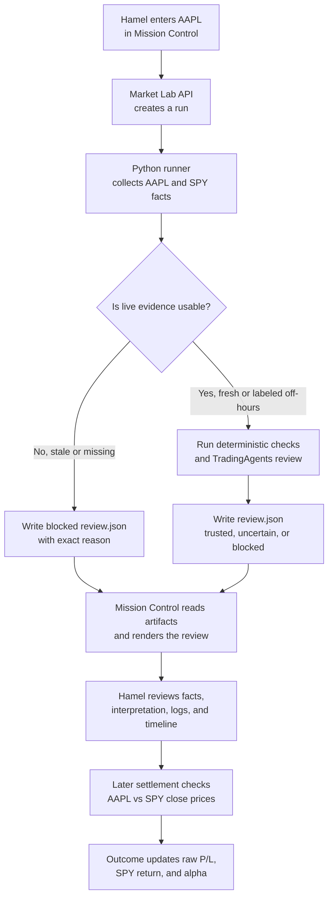
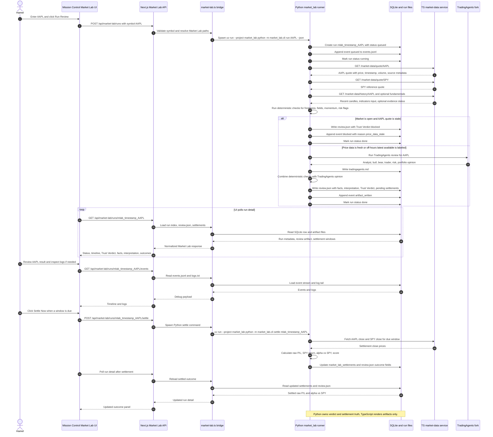

# Technical Specification - Market Lab V0 Forward-Looking Trust Reviews

**Document Status:** Implemented in PR #336

## Team

| Role | Assignee |
|------|----------|
| Owner(s) | Hamel |
| Epic | Market Lab V0 |
| PRD | [v0-forward-looking-trust-reviews.md](../PRDs/v0-forward-looking-trust-reviews.md) |

---

## Development Overview

Market Lab V0 is a new application direction inside `cortana-external`, not W15 and not a continuation of the old backtester sequence. The implementation should create a top-level Python project at `market_lab/` plus Mission Control API/UI surfaces under `apps/mission-control/`.

The Python engine owns the source-of-truth behavior: live price facts, deterministic checks, TradingAgents review orchestration, Trust Verdict calculation, artifact writes, and outcome settlement. Mission Control owns the product shell: start review, show background status, render the artifact, expose settle-now, and list prior runs.

The artifact contract is the boundary between Python and TypeScript. TypeScript must not reimplement verdict logic; it should read `review.json`, `events.jsonl`, `logs.txt`, and the SQLite run index.

Recommended runtime flow:

```text
Mission Control /market-lab
  -> POST /api/market-lab/runs
  -> TS spawns: uv run --project market_lab python -m market_lab.cli run SYMBOL --json
  -> Python creates SQLite row + run directory
  -> Python writes events/logs as the job progresses
  -> Python writes review.json + tradingagents.md
  -> Mission Control polls GET /api/market-lab/runs/:id
  -> User can inspect artifact, timeline, logs, and outcome status
```

### Order Of Operations For An AAPL Review

Simplified product flow:



Detailed system flow:



---

## Data Storage Changes

### Database Changes

Market Lab uses a local SQLite database at `.cache/market_lab/market_lab.sqlite`. This is not the existing Mission Control Postgres store and does not require a migration system in v0.

#### [NEW] market_lab_runs

| Constraints | Column Name | Column Type | Notes |
|-------------|-------------|-------------|-------|
| PK | run_id | TEXT | Stable run id, e.g. `mlab_20260508T210000Z_AAPL`. |
| NOT NULL | symbol | TEXT | Uppercase normalized ticker. |
| NOT NULL | requested_at | TEXT | ISO timestamp. |
| NOT NULL | status | TEXT | `queued`, `running`, `done`, `failed`. |
| | trust_verdict | TEXT | `trusted`, `uncertain`, `blocked`, null before artifact exists. |
| | verdict_reasons_json | TEXT | JSON array of reason strings or codes. |
| NOT NULL | run_dir | TEXT | Absolute path to `.cache/market_lab/runs/<run_id>`. |
| | review_path | TEXT | Path to `review.json`. |
| | events_path | TEXT | Path to `events.jsonl`. |
| | logs_path | TEXT | Path to `logs.txt`. |
| | tradingagents_path | TEXT | Path to `tradingagents.md`. |
| | error_message | TEXT | Final failure message if status is `failed`. |
| | created_at | TEXT | ISO timestamp. |
| | updated_at | TEXT | ISO timestamp. |

Indexes:

- `idx_market_lab_runs_symbol_requested_at` on `(symbol, requested_at DESC)`
- `idx_market_lab_runs_status_updated_at` on `(status, updated_at DESC)`
- `idx_market_lab_runs_verdict_requested_at` on `(trust_verdict, requested_at DESC)`

#### [NEW] market_lab_settlements

| Constraints | Column Name | Column Type | Notes |
|-------------|-------------|-------------|-------|
| PK | id | INTEGER | Autoincrement. |
| NOT NULL | run_id | TEXT | References `market_lab_runs.run_id`. |
| NOT NULL | window | TEXT | `1d`, `5d`, `20d`. |
| NOT NULL | status | TEXT | `pending`, `settled`, `failed`, `not_due`. |
| NOT NULL | due_at | TEXT | Expected market-date close timestamp. |
| | symbol_entry_price | REAL | Reference price at review time. |
| | spy_entry_price | REAL | SPY reference at review time. |
| | symbol_settlement_price | REAL | Market close price for the settlement window. |
| | spy_settlement_price | REAL | SPY market close price for the same window. |
| | raw_return_pct | REAL | Symbol return percentage. |
| | spy_return_pct | REAL | SPY return percentage. |
| | alpha_vs_spy_pct | REAL | `raw_return_pct - spy_return_pct`. |
| | score | TEXT | `success`, `failure`, `good_avoid`, `bad_avoid`, null while pending. |
| | settled_at | TEXT | ISO timestamp when settlement was written. |
| | error_message | TEXT | Settlement failure reason. |

Indexes:

- `idx_market_lab_settlements_due` on `(status, due_at)`
- `idx_market_lab_settlements_run` on `(run_id, window)`

### Filesystem Artifacts

```text
.cache/market_lab/
  market_lab.sqlite
  runs/<run_id>/
    review.json
    events.jsonl
    tradingagents.md
    logs.txt
```

Artifacts should be written atomically with temp-file + replace where possible. `events.jsonl` and `logs.txt` are append-only per run.

---

## Infrastructure Changes

### Cache Changes

Add `.cache/market_lab/` as the Market Lab runtime cache. If not already covered broadly, ensure `.cache/` remains gitignored and add a specific ignore entry only if necessary.

### Secrets Changes

No new tracked secrets. TradingAgents provider keys remain local environment variables. The Python adapter should fail with a clear `blocked` or `failed` state if required provider keys are missing.

Expected local inputs:

- `MARKET_DATA_SERVICE_BASE_URL`, defaults to `http://127.0.0.1:3033`
- TradingAgents/OpenAI/Anthropic/etc. keys as required by the selected provider
- optional `MARKET_LAB_CACHE_DIR`, defaults to `<repo>/.cache/market_lab`
- optional `TRADINGAGENTS_REPO_PATH`, defaults to `/Users/hd/Developer/TradingAgents` on the Mac mini

### Network/Security Changes

No external network listener is added. Mission Control API routes stay within the existing Next.js app. Mutating routes should use the existing same-origin/API-token patterns from `apps/mission-control/lib/api-auth.ts`.

---

## Behavior Changes

### New Operator Surface

Add a Mission Control Market Lab page where Hamel can:

- enter a symbol
- start one background review
- see queued/running/done/failed status
- inspect a step timeline
- open the final Trust Verdict and reasons
- inspect facts separately from interpretation
- view TradingAgents summary/raw output
- view settlement status for 1D, 5D, and 20D windows
- manually trigger settle-now for due windows

### Trust Verdict Behavior

Python owns verdict calculation:

- `blocked`: hard evidence problem, including stale/missing market-hours core price data, TradingAgents required review failure, invalid artifact, or no usable price basis
- `uncertain`: artifact is valid but evidence is mixed, weak, partial, or optional evidence is missing
- `trusted`: evidence is strong enough for future alert consideration, not execution

During market hours, quote freshness must be 5-10 minutes or the review blocks. Outside market hours, Market Lab may use latest available close or extended-hours price if the artifact labels `price_basis` clearly.

### Outcome Behavior

Every run records symbol and SPY reference prices. Settlements use market close prices for 1D, 5D, and 20D windows.

- trusted success: positive alpha vs SPY
- trusted failure: non-positive alpha vs SPY
- blocked/uncertain good avoid: symbol underperformed SPY
- blocked/uncertain bad avoid: symbol outperformed SPY

No broker execution, paper trading, or Telegram alerting occurs in v0.

---

## Application/Script Changes

### [NEW] Python engine

Create a top-level `market_lab/` project:

```text
market_lab/
  README.md
  pyproject.toml
  market_lab/
    __init__.py
    models.py
    runner.py
    market_data.py
    checks.py
    tradingagents_adapter.py
    verdict.py
    storage.py
    settlement.py
    cli.py
  tests/
    test_models.py
    test_checks.py
    test_verdict.py
    test_storage.py
    test_settlement.py
    test_runner.py
```

Responsibilities:

- `models.py`: Pydantic contracts for runs, events, facts, interpretations, outcomes, and review artifacts
- `runner.py`: orchestrates one symbol review without becoming a god object
- `market_data.py`: fetches quotes/history/fundamentals availability from the TS market-data service
- `checks.py`: deterministic freshness/data/risk checks
- `tradingagents_adapter.py`: invokes the fork at `/Users/hd/Developer/TradingAgents` or a configured path
- `verdict.py`: maps checks + TradingAgents result to `trusted`, `uncertain`, `blocked`
- `storage.py`: SQLite repository plus atomic artifact writes
- `settlement.py`: due-window detection and raw/alpha outcome calculations
- `cli.py`: debug commands

Preferred CLI shape:

```bash
uv run --project market_lab python -m market_lab.cli run AAPL --json
uv run --project market_lab python -m market_lab.cli show <run_id>
uv run --project market_lab python -m market_lab.cli events <run_id>
uv run --project market_lab python -m market_lab.cli settle <run_id>
uv run --project market_lab python -m market_lab.cli settle-due
```

### [NEW] Mission Control library

Create:

```text
apps/mission-control/lib/market-lab.ts
apps/mission-control/lib/market-lab.test.ts
```

Responsibilities:

- resolve repo/cache paths
- spawn Python CLI with `execFile` or `spawn` using an argument array, not shell string interpolation
- read SQLite/index/artifacts where appropriate
- normalize API response shapes
- expose loader functions to page/API routes

### [NEW] Mission Control routes

Create:

```text
apps/mission-control/app/api/market-lab/runs/route.ts
apps/mission-control/app/api/market-lab/runs/[runId]/route.ts
apps/mission-control/app/api/market-lab/runs/[runId]/events/route.ts
apps/mission-control/app/api/market-lab/runs/[runId]/settle/route.ts
```

Use `dynamic = "force-dynamic"` and `revalidate = 0`, matching existing runtime routes such as `apps/mission-control/app/api/trading-ops/live/route.ts`.

### [NEW] Mission Control UI

Create:

```text
apps/mission-control/app/market-lab/page.tsx
apps/mission-control/app/market-lab/market-lab-client.tsx
apps/mission-control/app/market-lab/market-lab-client.test.tsx
```

Update:

```text
apps/mission-control/components/sidebar.tsx
```

Add a `Market Lab` nav item separate from `Trading Ops` so the new application does not inherit old backtester framing.

---

## API Changes

### [NEW] Market Lab run list and creation

| Field | Value |
|-------|-------|
| **API** | `GET /api/market-lab/runs` |
| **Description** | List recent Market Lab runs from SQLite. |
| **Additional Notes** | Supports optional `symbol`, `status`, and `limit` query params. |

| Field | Detail |
|-------|--------|
| **Authentication** | Same-origin for browser use; API token when used externally if configured. |
| **URL Params** | `symbol`, `status`, `limit` |
| **Request** | None |
| **Success Response** | `{ status: "ok", data: { runs: [...] } }` |
| **Error Responses** | `500` on storage/load failure. |

| Field | Value |
|-------|-------|
| **API** | `POST /api/market-lab/runs` |
| **Description** | Start a background review for one symbol. |
| **Additional Notes** | Returns as soon as the Python job is accepted/started. |

| Field | Detail |
|-------|--------|
| **Authentication** | Same-origin required; API token optional for non-browser clients. |
| **Request** | `{ "symbol": "AAPL" }` |
| **Success Response** | `{ status: "ok", data: { runId, status, runDir } }` |
| **Error Responses** | `400` invalid symbol, `409` duplicate active run if implemented, `500` spawn/storage failure. |

### [NEW] Market Lab run detail

| Field | Value |
|-------|-------|
| **API** | `GET /api/market-lab/runs/:runId` |
| **Description** | Return run metadata, review artifact if present, and settlement state. |
| **Success Response** | `{ status: "ok", data: { run, review, settlements } }` |
| **Error Responses** | `404` run not found, `500` artifact parse/load failure. |

### [NEW] Market Lab run events

| Field | Value |
|-------|-------|
| **API** | `GET /api/market-lab/runs/:runId/events` |
| **Description** | Return parsed `events.jsonl` and log tail for debugging. |
| **Success Response** | `{ status: "ok", data: { events, logTail } }` |
| **Error Responses** | `404` run not found, `500` read failure. |

### [NEW] Market Lab settle action

| Field | Value |
|-------|-------|
| **API** | `POST /api/market-lab/runs/:runId/settle` |
| **Description** | Manually settle due windows for a run. |
| **Success Response** | `{ status: "ok", data: { runId, settlements } }` |
| **Error Responses** | `404` run not found, `500` settlement failure. |

---

## Process Changes

- Add docs that Market Lab is a new application direction, not W15.
- Keep old backtester runtime untouched for v0.
- Use `uv run --project market_lab ...` for local Python execution.
- Use existing Mission Control build/test flow after UI/API implementation:

```bash
cd /Users/hd/Developer/cortana-external/apps/mission-control
npx vitest run
pnpm build
```

- Use Market Lab pytest flow:

```bash
cd /Users/hd/Developer/cortana-external
uv run --project market_lab pytest
```

---

## Orchestration Changes

V0 review jobs are started by Mission Control invoking the Python CLI. No Redis, Celery, launchd service, or separate queue is introduced in v0.

Scheduled settlement can be implemented as a simple CLI command wired later to an existing runtime scheduler or cron surface:

```bash
uv run --project /Users/hd/Developer/cortana-external/market_lab python -m market_lab.cli settle-due
```

The first implementation may ship manual settle-now before scheduled settlement if needed, but the data model should support both from day one.

---

## Test Plan

Python tests:

- Pydantic artifact validation accepts valid artifacts and rejects missing required fields.
- Fresh market-hours price within 5-10 minutes passes freshness checks.
- Stale market-hours price blocks the review.
- Off-hours latest available price is accepted only with clear `price_basis`.
- TradingAgents failure maps to blocked or failed according to where failure occurs.
- Verdict calculation distinguishes `trusted`, `uncertain`, and `blocked` from check inputs.
- SQLite repository creates, updates, lists, and reloads runs.
- Settlement computes raw P/L, SPY return, alpha vs SPY, trusted success/failure, and good/bad avoid.

Mission Control tests:

- API routes validate symbols and return stable response shapes.
- Mutating routes require same-origin/API auth behavior consistent with existing patterns.
- `market-lab.ts` spawns Python with argument arrays and handles success/failure.
- UI renders run status, timeline, verdict, facts, interpretation, TradingAgents summary, and settlements.
- Sidebar includes Market Lab as a separate application from Trading Ops.

Manual validation:

- Run one symbol from Mission Control.
- Confirm `.cache/market_lab/runs/<run_id>/` contains expected files.
- Confirm `review.json` and UI show the same Trust Verdict and reasons.
- Simulate stale price data and confirm blocked verdict.
- Run settle-now after seeding due prices and confirm raw P/L plus alpha vs SPY render.
